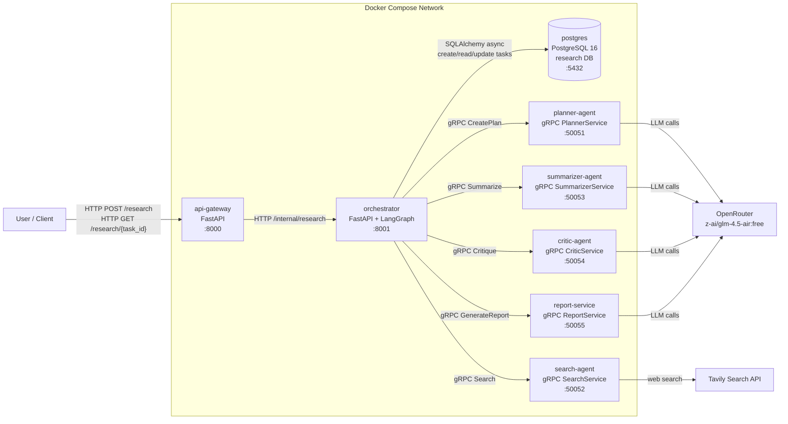
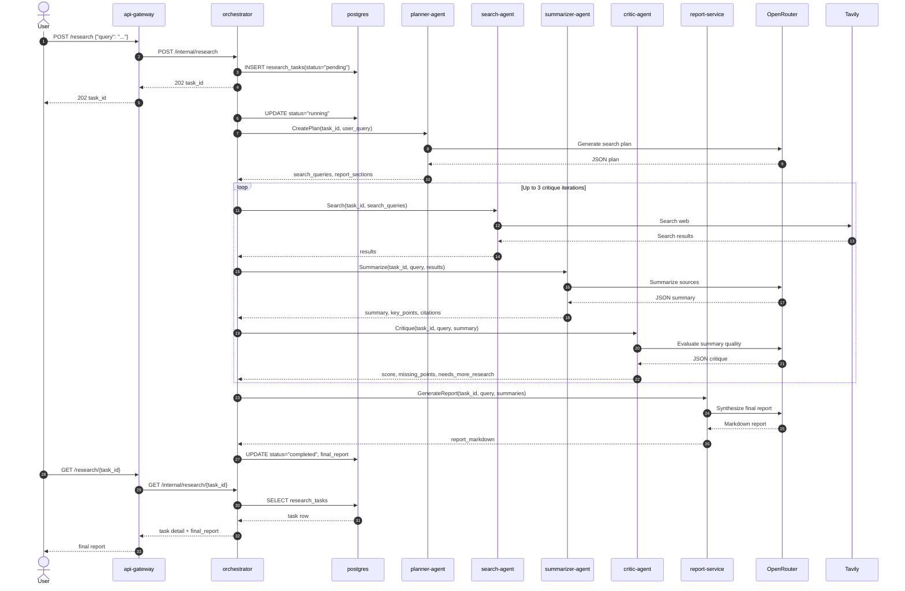

# Phase 2 System Architecture

This document describes the current Phase 2 multi-service research assistant architecture.

## Service Architecture



## Request Workflow



## Phase 2 Components

| Component | Role | Protocol | Port |
| --- | --- | --- | --- |
| `api-gateway` | Public HTTP entrypoint. Proxies research requests to the orchestrator. | HTTP/FastAPI | `8000` |
| `orchestrator` | Owns task persistence and LangGraph workflow execution. Calls agent services over gRPC. | HTTP/FastAPI + gRPC clients | `8001` |
| `postgres` | Stores `research_tasks`, status, iteration count, errors, and final reports. | PostgreSQL | `5432` |
| `planner-agent` | Converts the user query into search queries and report sections. | gRPC | `50051` |
| `search-agent` | Runs web searches through Tavily. | gRPC | `50052` |
| `summarizer-agent` | Summarizes search results and returns key points/citations. | gRPC | `50053` |
| `critic-agent` | Scores summary quality and decides whether more research is needed. | gRPC | `50054` |
| `report-service` | Synthesizes collected summaries into the final markdown report. | gRPC | `50055` |

## Runtime Configuration

The root `.env` provides the secrets used by Docker Compose:

```env
OPENROUTER_API_KEY=sk-or-v1-...
OPENROUTER_MODEL=z-ai/glm-4.5-air:free
TAVILY_API_KEY=tvly-...
LANGCHAIN_TRACING_V2=false
LANGCHAIN_API_KEY=
```

The orchestrator uses fixed Docker Compose service names for internal gRPC routing:

```env
PLANNER_AGENT_ADDRESS=planner-agent:50051
SEARCH_AGENT_ADDRESS=search-agent:50052
SUMMARIZER_AGENT_ADDRESS=summarizer-agent:50053
CRITIC_AGENT_ADDRESS=critic-agent:50054
REPORT_SERVICE_ADDRESS=report-service:50055
```

## Operational Notes

- Run the stack with `docker compose up --build`.
- Apply database migrations with `docker compose exec -T orchestrator uv run alembic upgrade head`.
- Submit work through `POST http://localhost:8000/research`.
- Poll status with `GET http://localhost:8000/research/{task_id}/status`.
- Fetch the final report with `GET http://localhost:8000/research/{task_id}`.
